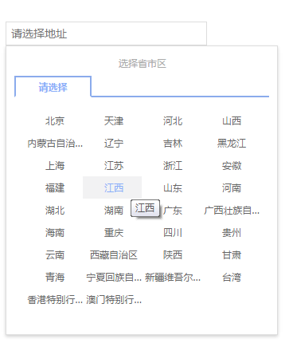
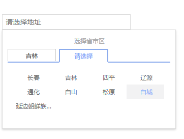

# kkCascader

vue组件：中国省市区级联组件 vue2.0


## 更新日志

### @1.0.0

## demo

示例（vue@2.0+） [点我](http://kuishang.github.io/kkCascader/index.html).


## 截图




## 依赖


## 地区列表数据源
[china-dist-data](https://github.com/dai-siki/china-dist-data).


## 安装

#### npm

```shell
$ npm install  kkCascader
```

## 使用


#### 相关参数

| 名称              | 类型               | 默认             | 说明                                         |
| ----------------- | ----------------- | ---------------- | --------------------------------------------- |
| placeholder       | String            | ""               | 你懂的                                     |

#### Events

| 名称              | 类型               | 默认             | 说明                                         |
| ----------------- | ----------------- | ---------------- | --------------------------------------------- |
| change       | methods            | ""               | 选定最后一级地区后触发，返回两个参数 第一个为地区id,第二个为选中城市的文字                                     |

#### 示例(vue@2.0+)

```html
<template>
  <div id="app">
   		<label for="dist">收货地址</label>
		  <dist-picker  placeholder="请选择地址" @change="change"></dist-picker>
  </div>
</template>

<script>
import distPicker from 'kkCascader'
export default {
  name: 'app',
  components: {
    'dist-picker': distPicker
  },
  methods: {
    change(id , value) {
      console.log(id, value)
    }
  }
}
</script>


```
